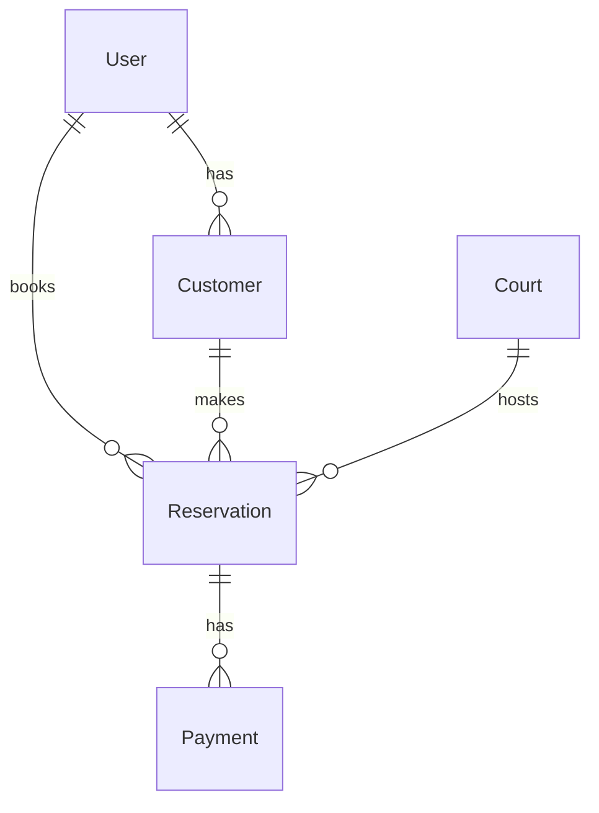

# 🎾 Royal Padel API

API REST para la gestión de reservas de canchas de pádel, un sistema completo que permite administrar usuarios, clientes, canchas, reservaciones y pagos, desarrollada con Node.js, Express y TypeScript.

## 🚀 Tecnologías

- Node.js + Express para el servidor
- TypeScript para tipo seguro
- PostgreSQL como base de datos
- Sequelize-TypeScript para ORM
- JWT para autenticación segura
- Nodemailer para emails transaccionales
- Express Validator para validaciones
- Bcrypt para encriptación

## 📦 Instalación

```bash
# Clonar el repositorio
git clone https://github.com/pakomercado0517/royal_padel_api.git

# Instalar dependencias
npm install

# Variables de entorno
Crear archivo .env con las siguientes variables:
DATABASE_URL=
FRONTEND_URL=
JWT_SECRET=
NODE_ENV=
NODEMAILER_HOST=
NODEMAILER_PASS=
NODEMAILER_PORT=
NODEMAILER_USER=
PORT=

# Iniciar en desarrollo
npm run dev

# Construir para producción
npm run build

# Iniciar en producción
npm start
```

## 📚 Modelos y Relaciones

El sistema implementa una arquitectura robusta con los siguientes modelos:

### 👤 User

- Gestión de usuarios y autenticación
- Roles: admin, staff, customer
- Atributos principales: fullName, email, phone, password_hash
- Gestión de tokens para confirmación y reset de contraseña
- Estado de activación de cuenta

### 👥 Customer

- Información detallada de clientes
- Vinculación con usuario del sistema (userId requerido)
- Notas adicionales (opcional)
- Historial de reservaciones
- Los datos personales (fullName, email, phone) se obtienen del User vinculado
- Se crea automáticamente al registrar un nuevo usuario con rol "customer" (rol por defecto)
- La creación automática inicializa el campo notes como vacío

### 🏸 Court (Cancha)

- Gestión de canchas disponibles
- Control de estado activo/inactivo
- Tipo de superficie
- Historial de reservaciones

### 📅 Reservation

- Sistema completo de reservaciones
- Estados: pending, confirmed, cancelled, no_show, completed
- Vinculación con cancha y cliente
- Registro de usuario que realizó la reserva
- Control de fechas y horarios
- Gestión de cantidad de jugadores
- Sistema de precios en centavos

### 💰 Payment

- Registro completo de pagos
- Métodos: cash, card, transfer, online
- Estados: pending, paid, refunded, failed
- Manejo de moneda y cantidad en centavos
- Referencias externas para pagos
- Registro de fecha de pago

## 🛣️ Rutas API

### 🔐 Autenticación (/user)

| Método | Ruta                   | Descripción          | Payload Requerido                          |
| ------ | ---------------------- | -------------------- | ------------------------------------------ |
| POST | /create_account | Crear cuenta y perfil de cliente | fullName, email, password, phone(opcional). Crea automáticamente el perfil de cliente si el rol es "customer" |
| POST   | /confirm_account       | Confirmar cuenta     | token(6 dígitos)                           |
| POST   | /login                 | Iniciar sesión       | email, password                            |
| POST   | /forgot_password       | Recuperar contraseña | email                                      |
| POST   | /validate_token        | Validar token        | token(6 dígitos)                           |
| POST   | /reset_password/:token | Cambiar contraseña   | password, token(param)                     |

### 🔒 Seguridad

Todas las rutas (excepto autenticación) requieren token JWT:

```http
Authorization: Bearer <token>
```

### 📨 Respuestas

Formato estándar de respuestas:

✅ Éxito:

```json
{
  "message": "Mensaje de éxito",
  "data": { ... }
}
```

❌ Error:

```json
{
  "error": "Mensaje de error"
}
```

### 📝 Validaciones

Las rutas incluyen validaciones para:

- Nombre completo requerido
- Email válido
- Contraseña mínimo 6 caracteres
- Teléfono en formato MX (opcional)
- Roles válidos: admin o user
- Token de 6 dígitos para confirmaciones

## 🔒 Autenticación

El sistema utiliza JWT (JSON Web Tokens) para la autenticación de usuarios. El token debe incluirse en el header de las peticiones:

```
Authorization: Bearer <token>
```

## ✉️ Emails Transaccionales

Se envían emails automáticos para:

- Confirmación de cuenta
- Reset de contraseña

Los templates incluyen:

- Diseño responsive
- Soporte para modo oscuro
- Códigos de verificación de 6 dígitos
- Enlaces de acción
- Marca personalizada

## 🛠️ En Desarrollo

### Próximas Funcionalidades

#### 🏸 Gestión de Canchas

- CRUD completo de canchas
- Gestión de disponibilidad
- Horarios especiales
- Mantenimientos programados

#### 📅 Sistema de Reservas

- Reservas recurrentes
- Cancelaciones automáticas
- Lista de espera
- Notificaciones en tiempo real

#### 💳 Procesamiento de Pagos

- Integración con pasarelas de pago
- Facturación automática
- Reportes financieros
- Gestión de reembolsos

#### ⚙️ Panel de Administración

- Dashboard con métricas
- Gestión de roles y permisos
- Reportes personalizados
- Configuración del sistema

## 📊 Base de Datos



## 🔄 Estado del Proyecto

- ✅ Sistema de autenticación
- ✅ Gestión de usuarios
- ✅ Emails transaccionales
- 🏗️ Gestión de canchas
- 🏗️ Sistema de reservas
- 🏗️ Procesamiento de pagos

---

Desarrollado por [Francisco Mercado](https://github.com/pakomercado0517) 🚀
